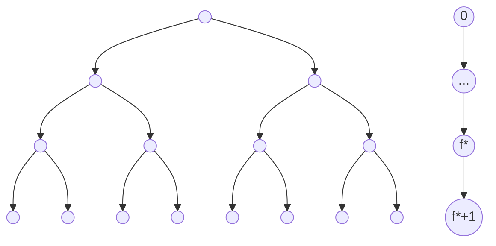

# General Formula for Divide and Conquer Algorithms
### [Opening a black box](https://youtu.be/SYomOZIfeoU) you didn't know you had.

I want to show you my favorite formula ever.
I never saw any programmer use it, ever.
I did use it once. I could have done the same work in 2 minutes, but I decided to take 30+ minutes to have a more precise result (and because it was a lot more fun this way).

It can be used to estimate performance on a particular class of algorithms. Basically it's a stronger but harder to calculate version of the [big O notation](../posts/big_o_omega_theta_notation.md).
It's not particularly useful since you can get basically the same result with big O notation or with the [Master Theorem](https://en.wikipedia.org/wiki/Master_theorem_(analysis_of_algorithms)), but I still find this formula cool, so I want to show it.

Here it is, in all its majesty:

$$
T(n) = \sum_{l=0}^{f^*(n,n_0)} \left( \left[ \prod_{j=0}^{l-1} s \left( f^{(j)}(n)\right) \right] w \left( f^{(l)}(n) \right) \right) +
\left[ \prod_{j=0}^{f^*(n,n_0)} s \left( f^{(j)}(n)\right) \right]T^0
$$

This is called the "General Formula for Divide and Conquer Algorithms"

If when seeing this you got scared this post is not for you.
If you want to learn how this beast works, then this is the perfect post for you, because we're about to delve *much* deeper.

## When can this be used ?

If you've read carefully then you might already know when this formula can be used. It's used for a class of programming algorithms called "Divide and Conquer".
Basically an algorithm is said to be in that class when the algorithm splits a given problem instance into smaller easier to solve instances, solves those, and then fuses them back together into a final solution. That's exactly where the name comes from. The first is called the Divide step, while the last is the Conquer step.
Many famous algorithms are exactly in this class of problems, like multiplying two matrices, the famous merge sort, making the exponential faster or the famous Fast Fourier Transform.

When you have a Divide and Conquer algorithm you can almost always use the General Formula. You only have 2 other restrictions:
1. Each instance of size n divides into the same number of sub-instances. 
    This is basically always true, it's like asking the algorithm to not be random. For example for merge sort the array will be **always** split into 2 smaller ones, Strassen's algorithm for multiplying two matrices **always** divides into 7 smaller ones etc.
2. Each smaller sub-instance you divide into has the same size.
    This is NOT always true. Yeah when merge sort divides the array you get 2 smaller ones, but if the bigger array has an odd size you get an odd and an even sized array. You cannot divide an array of 13 elements into 2 arrays of the same size, the best you can do is one of size 6 and one of size 7. Sometimes you can work around this problem, for example using merge sort if the array has size $2^n$ then you'll always divide it cleanly.

If you can guarantee these 2 restrictions then you'll be able to write your algorithm complexity into his compact form:

$$
T(n) = 
\begin{cases}
T_0 & n \leq n_0 \\ 
s(n)T(f(n)) + w(n) & n \gt n_0
\end{cases}
$$

$n$ is the size of the instance of the problem.
$T(n)$ is the performance you want to calculate.
$n_0$ is the size of the smaller sub-instances.
$T_0$ is the work to solve those smallest instances.
$s(n)$ is a function saying how many instances you dive into.
$f(n)$, which is called the contraction function, is a function saying the new size of the instances at the divide step of the algorithm.
Finally $w(n)$ is the work done during the conquer step of the algorithm.

Since $T(n)$ measures the work done by the algorithm it should all make sense right? it's basically just saying "the work done by the algorithm is either the work to solve the smallest steps, or the work done to solve smaller instances + some work to join them".

As an example, during merge sort, $n$ is the size of the array, $T(n)$ is the complexity of the algorithm, $s(n)$ is 2, since we always divide the array in 2 smaller ones of size $n/2$, which is $f(n)$, $n_0$ is the size of the smallest arrays, which is 1, $T_0$ is the work to join those arrays, which is also 1, and $w(n)$ is the work to join bigger arrays, which is about $n$ in the worst case.

Merge sort can then be written as

$$
T(n) = 
\begin{cases}
1 & n \leq 1 \\ 
2T(n/2) + n & n \gt 1
\end{cases}
$$

When you have the algorithm into this compact form you can almost immediately proceed with using the General Formula to calculate it's precise complexity. You know that big O complexity ignores constants right? If you have 2 O(n) algorithm can you tell me which is the fastest without writing them? For example you algorithms could have a complexity of 2n-1 and 2n+3 and you wouldn't immediately know.  This is where the General Formula comes into play. By using that you would get all those constants back, knowing the algorithm's precise complexity.

I never saw any programmer use this, maybe because it's too scary to understand?
Well I think it's time to change that.

As I said, if you have the algorithm into its compact form you can immediately start to calculate the exact algorithm complexity. 

Now that we know the compact form let's look at the algorithm once again:

$$
T(n) = \sum_{l=0}^{f^*(n,n_0)} \left( \left[ \prod_{j=0}^{l-1} s \left( f^{(j)}(n)\right) \right] w \left( f^{(l)}(n) \right) \right) +
\left[ \prod_{j=0}^{f^*(n,n_0)} s \left( f^{(j)}(n)\right) \right]T^0
$$

As you can see we have almost everything we need. We just need to calculate $f^{(j)}(n)$ and the $f^*(n,n_0)$.
This is exactly what we'll do in the next sections.

## Iterate Function
Here we'll show how to calculate $f^{(j)}(n)$, which is called the "iterate of f".

First we need to understand what it's purpose is.
Each time during the divide step of the algorithm, the function gets recursively called with a smaller problem to solve.
If you really think about it you should realize this makes a tree of recursive calls, each one with a smaller size, something like this:

Where the first node is the first call at level 0, then as you go further down the size of the instances decreases by one contraction $f(n)$, meaning the function gets repeatedly applied to itself. That's what that $f^{(j)}(n)$ means. We also call the **penultimate** layer $f^*(n,n_0)$. The penultimate, not the last one. The last layer is the leaves of the graph, the last *internal* layer is the maximum number of times we can apply the contraction while staying with non-trivial instances of the problem.

In it's rawest form:

$$
f^{(x)}(n) = 
\begin{cases}
n & x = 0 \\ 
f(f^{(x-1)}(n)) & x \gt 0
\end{cases}
$$

or said another way: $f^{(x)}(n) = f(f(....f(n))$

Basically the iterate is "what do I get if I apply the function to itself x times?"

It's best to see with examples.
Say we have $f(n) = n-1$
What do we get it we apply f to itself 1 time? Well we just get back $f(n) = n-1$
What if we apply it 2 times? We get $f(f(n)) = f(n-1) = (n-1) - 1 = n-2$
If we repeat x times we get $f^{(x)}(n) =n-x$

Now a more complex example, say we have $f(n)=n/a$
If we apply the function to itself x times we get

$$
\begin{matrix}
f^{(0)}(n) = n \\
f^{(1)}(n) = \frac na \\
f^{(2)}(n) = \frac n{a^2} \\
.\\
.\\
.\\
f^{(x)}(n) = \frac n{a^x} \\
\end{matrix}
$$

It should be intuitive why we're doing this right? The algorithm divides the input into smaller and smaller pieces, it shouldn't be a surprise that we need to do the same to know how complex is the algorithm. We're basically creating a formula for "at step x the array will have a size of $n/{2^x}$, so an array of size $n$ at step 2 will have a size of $n/2^2 = n/4$, at step 3 a size of $n/8$ and so on."

## Star Function
Here we'll show how to calculate $f^*(n, n_0)$, which is called "f star".

Again, $f^*(n,n_0)$ is used to calculate what's the final layer of non-trivial cases, which is **not** the final layer of the graph, since that's for trivial cases. It's the one before that.

In it's raw form:

$$
f^*(n, n_0) = max \left\\{ k |f^{(k)}(n) > n_0 \right\\}
$$

The final layer would be when $f^{(k)}(n) = n_0$, but we need the one before that. You'll see later why.

Let's look at the same examples as before:

$$
\begin{matrix}
f(n) = n-1 \\
f^{(k)}(n) = n-k \\
\end{matrix} \\
\begin{matrix}
\begin{aligned} 
f^*(n, n_0) &= max \left\\{ k |f^{(k)}(n) > n_0 \right\\} \\
&= max \left\\{ k | n-k > n_0 \right\\} \\
&= max \left\\{ k | k < n - n_0 \right\\} \\
&= n - n_0 -1
\end{aligned}   
\end{matrix}
$$

and a more complex:

$$
\begin{matrix}
f(n) = \frac na \\
f^{(k)}(n) = \frac n{a^k} \\
\end{matrix} \\
\begin{matrix}
\begin{aligned} 
f^*(n, n_0) &= max \left\\{ k |f^{(k)}(n) > n_0 \right\\} \\
&= max \left\\{ k | \frac n{a^k} > n_0 \right\\} \\
&= max \left\\{ k | k < log_a \left( \frac n {n_0} \right) \right\\} \\
&= log_a \left( \frac n {n_0} \right) - 1
\end{aligned}   
\end{matrix}
$$

Yes that $-1$ will pop up a lot.

Look at what really happened. 
If the size decreases by 1 each time ( $f(n)=n-1$ ), how many layers does the call graph have until it reaches a final size of 1 ( $n_0=1$ )? It has $f^*(n,1)=n-1-1=n-2$ layers of internal nodes, which are non trivial instances of the problem, and a layer of trivial instances, or leaves.

During merge sort the array halves each time ( $f(n)=n/2$ ).
You can easily merge 2 arrays of size 1 ( $n_0=1$ ).
How many layers does the call graph have until a trivial array size?
It has $f^*(n, 1) = log_2 (n) - 1$ non trivial layers of solutions to compute (arrays bigger than 1) and 1 layer of trivial solutions (array of size 1).

Using the iterate of the contraction and $f^*$ you can know how many times you need to subdivide the instance of the problem into smaller ones. 
The only missing step is combining these informations with the work of each conquer step to arrive at the final total work of the algorithm.

## General Formula

We are ready to combine everything to create the General Formula.
As a quick refresher, the formula is used to calculate the total work of a Divide and Conquer algorithm.

Recall the algorithm compact form:

$$
T(n) = 
\begin{cases}
T_0 & n \leq n_0 \\ 
s(n)T(f(n)) + w(n) & n \gt n_0
\end{cases}
$$

You start the algorithm with a single instance of the problem (like reordering an array using merge sort).
How much work does that instance need to do? Since it's too big you'll need to divide it, solve those and then do some work to join them back together. So at level 0 the single node has to do $w(n)$ amount of work. Remember, $w(n)$ is the work to join back smaller instances.
Then how much instances do you create? Since you divide into $s(n)$ pieces you have $s(n)$ instances each with a smaller size $f(n)$.
Remember, when merge sort splits the array you create $s(n)=2$ instances each with new size $f(n)=n/2$.

If you do this for each level and track everything into a table you get something like this.

|node type|level|size|num nodes per lvl| work per node|
|---|:-:|:-:|:-:|:-:|
|internal|0|$n=f^{(0)}(n)$|$n$|$w(n)=w(f^{(0)}(n))$|
|internal|1|$f(n)=f^{(1)}(n)$|$s(n)=s(f^{(0)}(n))$|$w(f(n))=w(f^{(1)}(n))$|
|internal|2|$f^{(2)}(n)$|$s(n) \cdot s(f^{(2)}(n))$|$w(f^{(2)}(n))$|
|...|...|...|...|...|
|internal|$l \leq f^*(n,n_0)$|$f^{(l)}(n)$|$\prod_{j=0}^{l-1}s(f^{(j)}(n))\\;$|$w(f^{(j)}(n))$|
|leaf|$f^*(n,n_0)+1$|$\leq n_0$ |$\prod_{j=0}^{f^*(n,n_0)}s(f^{(j)}(n))\\;$|$T_0$|

Ok, now the final step.
What's the total work of the algorithm?
Well it's 2 parts: the work of every internal node + the work for each leaf node.

Let's start with the second since it's easier. Just look at the table, bottom row, last column. It's $T_0$.
How many leaf nodes are there? It's that product in the second to last column.

$$
\text{work for leaf nodes} = T_0 \cdot \left[ \prod_{j=0}^{f^*(n,n_0)} s \left( f^{(j)}(n)\right) \right]
$$

Now what's the total work for each internal node at a single layer?
It's just the work of a node at that layer, times the number of nodes in that layer.

$$
\text{work for internal nodes at layer } l = w \left( f^{(l)}(n) \right)  \cdot \left[ \prod_{j=0}^{l-1} s \left( f^{(j)}(n)\right) \right] 
$$

What's the work for *all* internal nodes?

It's just the sum of work for nodes at each layer

$$
\text{work internal nodes} = \sum_{l=0}^{f^*(n,n_0)} \left( \left[ \prod_{j=0}^{l-1} s \left( f^{(j)}(n)\right) \right] w \left( f^{(l)}(n) \right) \right)
$$

And finally:
What's the work for the entire algorithm? It's the sum of the work for internal nodes and for leaf nodes
The general formula:

$$
T(n) = \sum_{l=0}^{f^*(n,n_0)} \left( \left[ \prod_{j=0}^{l-1} s \left( f^{(j)}(n)\right) \right] w \left( f^{(l)}(n) \right) \right) +
\left[ \prod_{j=0}^{f^*(n,n_0)} s \left( f^{(j)}(n)\right) \right]T^0
$$

## A big example

To finish the work done in this post, let's calculate the total work done by an algorithm, from start to finish.

Remember what I said at the start? That I've used this formula to calculate the performance of an algorithm in 30 minutes instead of 2? Well let's see that exact example.

Let's say your into game development like me. You might already know what Bezier curves are. If you don't I'd suggest looking them up on the internet.
Long story short, If you want to create a Bezier curves out of $n$ points, you have to calculate that curve by lerping two smaller curves of $n-1$ points.
Basically the algorithm takes a list of $n$ points and a parameter to calculate the curve in the range 0 to 1.
You have to divide the list of points into 2 smaller lists, one from 0 to n-1 and one from 1 to n. You'll pass these new list of points into the algorithm itself which will give you back 2 points, one from each curve. The final work is lerping those 2 points to produce the final point.

The trivial step is when the list has 2 points, that's just `lerp(list[0], list[1], param)`, which is easy to calculate.

You might see how this is REALLY inefficient. Each time you need to calculate 2 new points on a list just smaller by 1. 2 times 2 times 2 over and over again is basically a $O(2^n)$ algorithm right?
Well we'll see.

Without getting into the code, here's the algorithm compressed form:

$$
T(n) = 
\begin{cases}
1 & n \leq 2 \\ 
2T(n-1) + 1 & n \gt 2
\end{cases}
$$

Now let's calculate the work using the general formula.

First: $f^{(j)}(n)$
since $f(n) = n-1$ we've already calculated $f^{(j)}(n)$ before:

$$
\begin{matrix}
f^{(0)}(n) = n \\
f^{(1)}(n) = n - 1 \\
f^{(2)}(n) = n - 2 \\
.\\
.\\
.\\
f^{(x)}(n) = n - x \\
\end{matrix}
$$

Second: $f^*(n,2)$

$$
\begin{matrix}
\begin{aligned} 
f^*(n, 2) &= max\left\\{ k |f^{(k)}(n) > 2 \right\\} \\
&= max \left\\{ k | n - k > 2\right\\} \\
&= max \left\\{ k | k < n-2 \right\\} \\
&= n-3
\end{aligned}   
\end{matrix}
$$

And finally: the General Formula

$$
\begin{matrix}
\begin{aligned} 
T(n) &= \sum_{l=0}^{f^*(n,n_0)} \left( \left[ \prod_{j=0}^{l-1} s \left( f^{(j)}(n)\right) \right] w \left( f^{(l)}(n) \right) \right) +
\left[ \prod_{j=0}^{f^*(n,n_0)} s \left( f^{(j)}(n)\right) \right]T^0 \\
&= \sum_{l=0}^{n-3} \left( \left[ \prod_{j=0}^{l-1} 2 \right] 1\right) +
\left[ \prod_{j=0}^{n-3} 2 \right]1
\end{aligned}   
\end{matrix}
$$

One piece at a time:
The part on the right is simpler so let's start with that

$$
\begin{matrix}
\begin{aligned} 
R(n) &= \prod_{j=0}^{n-3} 2 = 2\cdot 2 \cdot 2 \cdot \cdot \cdot 2 = 2^{n-2}
\end{aligned}   
\end{matrix}
$$

And the left part one piece at a time

$$
\begin{matrix}
\begin{aligned} 
L_1(n) &= \prod_{j=0}^{l-1} 2 = 2\cdot 2 \cdot 2 \cdot \cdot \cdot 2 = 2^{l} \\
L(n) &= \sum_{l=0}^{n-3} \left( \prod_{j=0}^{l-1} 2\right) = \sum_{l=0}^{n-3} 2^l = 2^0 +  2^1 + ... +2^{n-3} = 2^{n-2}-1
\end{aligned}   
\end{matrix}
$$

And putting $L(n)$ and $R(n)$ together

$$
T(n) = L(n) + R(n) = 2^{n-2} - 1 + 2^{n-2} = 2^{n-1} - 1 = \frac12 2^n - 1
$$

And that's it.
I could have said "Yeah it's O(2^n)" in about 30 seconds. I decided to take 30 minutes to instead say "it's exactly $\frac12 2^n - 1$".

I still think it was worth it.

## Closing

So there it is. That's my favorite formula ever. 

I think people gets scared too easily, i mean, it wasn't so hard to calculate the performance of those bezier curves, wasn't it? It's just a lot of scary symbols but once you know what they mean it's actually surprisingly easy to use.

And it's also useful, you can get a better look into performance. Again if you have two $O(n)$ algorithms, you don't have that many options to look which is the faster one. This is a tool that helps.

