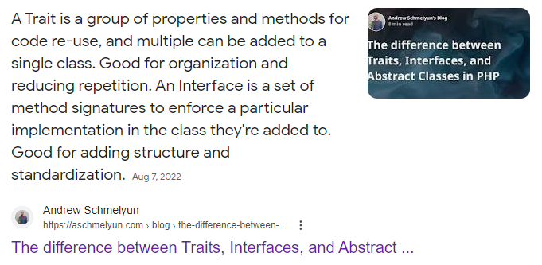

# The REAL difference between Trait and Interfaces
### Or at least one difference

## What you find on the internet
A quick search on the internet shows that actually most programmers don't know the difference between traits and interfaces.

This is the first result you get on google if you search "trait vs interface"

If you *carefully* read this result you'll quickly find this nonsensical.
It's true that "a Trait is a group of properties and methods for code re-use", but so are interfaces! It's true that "multiple traits can be added to a single class", but so can interfaces! Its' true that "an Interface is a set of method signatures to enforce a particular implementation in the class they're added to" but so are traits! It's true that "interfaces are good for adding structure and standardization" but so are traits!

These definitions, while true, are completely useless. They don't give the difference between traits and interfaces.
If you continue searching you'l find that actually *most* results are completely useless.

That's why this blogpost exists, to give one *actual* difference between them.

## One REAL difference

You can have 2 types of interfaces: the ones you created and the ones someone else did.
At the same time there exist types you created or types someone else did.
This creates a 2x2 matrix of 4 possibilities.

||Your interface|External interface|
|-|:-:|:-:|
|Your type|??|??|
|External type|??|??|

For the purpose of this discussion, interfaces/traits/types you created are also called *user defined* or *internal*, while interfaces/traits/types someone else created are also called *library defined* or *external*.

It's obviously true that you can implement your interfaces on your types, and you can also implement external interfaces on your types. This fill half of the matrix.
But interfaces can only do those 2 things. You **cannot** implement user defined interfaces on external types, and you also cannot implement external interfaces onto external types.

This means that you can use the matrix to answer one simple question: "Which interfaces can I implement on which types?"

||Your interface|External interface|
|-|:-:|:-:|
|Your type| Yes | Yes |
|External type| No | No |

Now, what about traits?
When you create the corresponding matrix you'll come across one *REAL* difference between them.
You can also implement *your* traits on *external* types!

||Your trait|External trait|
|-|:-:|:-:|
|Your type| Yes | Yes |
|External type| **Yes** | No |

## Can we *ever* fill the matrix?

One thing to note is that both external interfaces and external traits cannot be implemented for external types.
Is that always the case? Does something exist that can?
By thinking about it for a moment we can figure out that actually nothing can.

Say for a moment that you actually could. Then you could import 2 different libraries that both implement an external trait for an external type, but in 2 different ways.
What if you used 2 libraries in Rust that both implemented the Display trait on the Vec struct, but in different ways?
That would make the libraries incompatible with each other, so most of the times languages avoid the problem altogether by not letting the user implement external traits on external types.

This is basically a more complicated version of the [Diamond Problem](https://en.wikipedia.org/wiki/Multiple_inheritance), so I don't think we will see a language that enables that.
